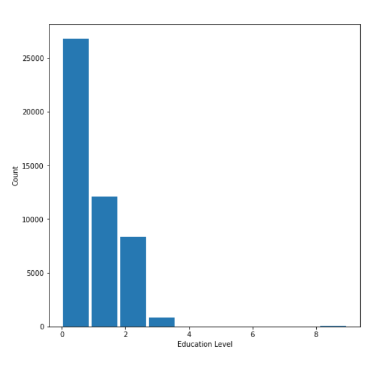
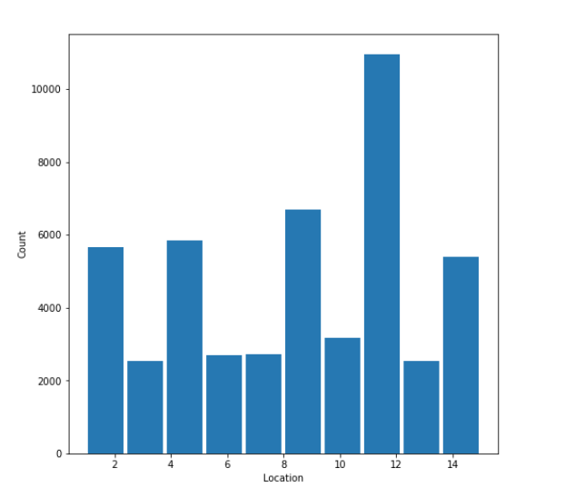
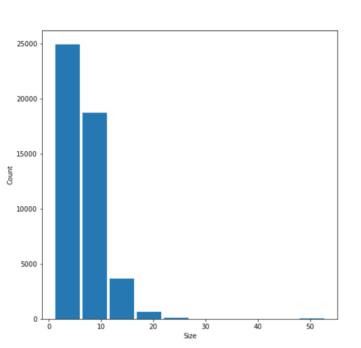
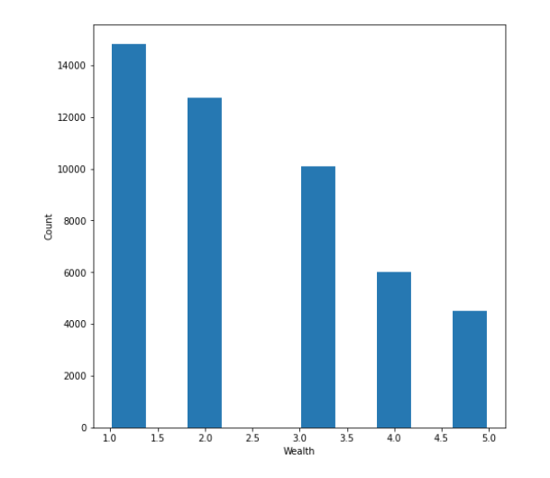
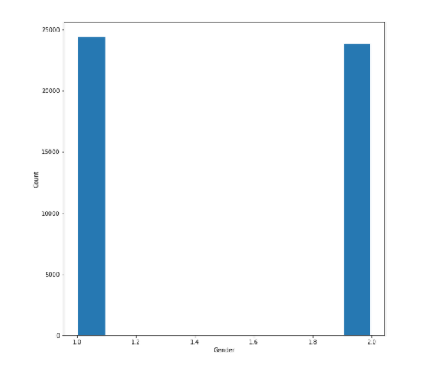
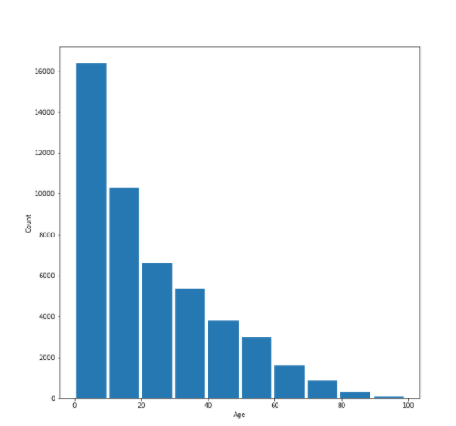

# Analyzing Liberia’s Demographic Data
Emma Dubin
# 1.	Introduction
When creating policies and establishing resources to address education deficits in a population, policymakers must not only know what the education levels of said population are, but also why those education levels are what they are. There are numerous factors that can influence an individual’s level of education, including their location, size, wealth, gender, and age. In the event that Liberian policymakers want to change the overall education levels of their country, they must first recognize the underlying factors that may be contributing to low education levels while also understanding what factors promote higher education levels. In order to better understand this along with numerous other demographic information, the Liberia Institute of Statistics and Geo-Information Services released the 2013 Liberia Demographic and Health Survey. For our research purposes, we will focus on a subset of data released as a result of this survey. This subset of data contains 48,219 data points from individuals. For each individual, there are several independent variables— location, size, wealth, gender, and age. There is also the dependent variable— education.
# 2. Summary Statistics
Number of Observations = 48,219

The average level of education of an individual in Liberia is 0.6653. The average size is 6.9345. The average wealth is 2.4319. The average age is 22.4990.

Table 2.1: Averages, Standard Deviations, and Ranges of Numerical Variables.
 

There are two genders in the data set. There is a slight majority in Gender 1. There are 15 localities in the data set. The location with the most data points is location 11 with 13.20% of the individuals from there.

Table 2.2: Counts & Proportions for Gender and Location
 

The average education level for a person of gender 1 is 0.8153. The average education level for a person of gender 2 is 0.5118.

Table 2.3: Average and Standard Deviation of Education by Gender

Compared to the average education associated with the complete set of data, the average for individuals with above average (>2.4319) wealth is higher (31.87% increase). There is also more variation in the education levels of the above average wealth subset than there is for the total education level. The average education for the top wealth tier (where wealth is equal to 5) is also significantly higher than the total education average (90.21% increase). In this subset, the data continues to become even more varied than both the original set of data and the above average wealth subset. The average education level for individuals with below average wealth is less than the all data average with a 23.84% decrease. This subset also appears to have the least variation of any of the other education subsets.

Table 2.4: Average and Standard Deviations of Variables of Above/Below Average Wealth Individuals

# 3. Histograms
## 3.1: Education
The data is skewed right meaning that there are more individuals with low education levels than there are with high education levels. This means the surveyed population of Liberia is made up of mostly low leveled education individuals. The data is unimodal with a peak at 0-1, showing that most of the population falls into that education range than any other range. 

Figure 3.1: Education Counts

## 3.2: Location
The location data shows the number of surveyed individuals in each locality of Liberia. The data is unimodal with a peak at 11, indicating that this locality is the most populous amongst those who were surveyed. 

Figure 3.2: Location Counts

## 3.3: Size
The size data is very skewed to the right meaning that there are more individuals with low size levels than there are with high size levels. The data is unimodal with a peak at 0-5, showing that more of the population falls into that size range than any other range.

Figure 3.3: Size Counts

## 3.4 Wealth
The wealth data appears to be much more evenly distributed than the previous variables. However, the data still seems to be skewed towards the right. 

Figure 3.4: Wealth Counts

## 3.5 Gender
The gender data appears to be evenly split between the two dummy variables, yet there does appear to be slightly more gender one data points than gender 2 points. 

Figure 3.5: Gender Counts

## 3.6 Age
The age data is skewed to the right and unimodal with a peak at 0-10.

Figure 3.6: Age Counts

